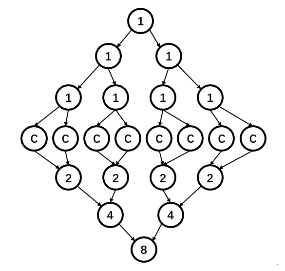

## 选择题
1. 哪些措施提高IPC、降低指令数N、提高主频f
2. 常见主机 CPU与主存、CPU与GPU、与磁盘之间传输速率
3. 线程现场包括哪些东西，多线程处理器为了解决哪些问题
4. 网络拓扑 crossbar、Mesh、回环 使用的设备数和最大跳数
5. MSI 协议填表，处理器P1和P2，初始如下，（1）哪个值是最新（2）P2读A之后填表（3）P2 写A=A+1后填表

| P1: address | status | value |     | P2:address | status | value |     | memory: A value |
| ----------- | ------ | ----- | --- | ---------- | ------ | ----- | --- | --------------- |
| A           | M      | 10    |     | A          | I      | 8     |     | 8               |

## 简答/计算题
顺序不记得，也可能有漏，欢迎补充

1. 阿姆达尔定理，程序 85% 可并行部分，问32线程时加速比，最大加速比

2. 给定交换机、机柜、节点的网络互联结构，问这个结构对于 MapReduce 中 Map 节点的分配方式、以及 GFS 中 chunk server 的分配方式有什么影响 （所以是在问什么？一直不会）

3. JAVA 分代 GC 的合理性以及实现方式

4. JIT即时编译，给某部分代码解释运行一次耗时，执行超过20次后编译运行，给编译时间，编译后运行一次耗时，（1）计算这部分被运行30、60、100次时间 （2）被运行至少多少次 JIT 才是有优化效果的

5. MPI程序阅读，n=5 由rank0 开始向后一个进程传递一个 int，最后一个进程传回 rank0，（1）给出输出（2）解释一下程序在干什么

6. 给出一个程序中Load、Store、分支、整数加法、整数移位、乘法指令的占比，和所需周期，（1）计算平均CPI （2）B机器时钟频率为1.2倍，但乘法指令周期改变为xxx，问哪个快

7. 程序 `for(int i = 0; i < 1024; i++) sum += x[i]` ，其中 x 数组为1024个整数，给出汇编指令大致如下，LOAD指令cache hit 2周期，cache miss 100周期，ADD和CMP指令 1周期，BL 4周期，LOAD指令的后续指令若不是LOAD或与要加载的值无依赖可以继续发射（在这题中R2,R3都无依赖，意思可能是cache hit时2周期可以掩盖R2的1周期，cache miss时可以掩盖掉这两个，再后一条有依赖必需等待LOAD），给定 cache 大小 32KB，cache line大小128B，主频 500MHz
```assembly
# R1数组元素，R2数组指针，R3 i，R4数组和
LOOP:
	LOAD  R1,[R2]
	ADD   R2,R2,4
	ADD   R3,R3,1
	ADD   R4,R4,R1
	CMP   R3,1024
	BL    LOOP      # branch if less than
``` 
（1）无分支预测，估计执行时间
（2）处理器B，1bit 分支预测器，预测成功分支指令不耗时，预测失败 4周期，第一次预测默认失败，其他一致，估计执行时间，计算相对A加速比

8. 某个任务 $2^n$ 图，分解任务耗时1，计算耗时c，合并耗时与规模相当，给出规模 $2^3$ 任务图示如下
（1）总任务量、关键路径、加速比
（2）效率=加速比/处理器数，效率大于80%，c 最少为多少
（3）c 为固定值时，随 n 增加，效率如何变化
