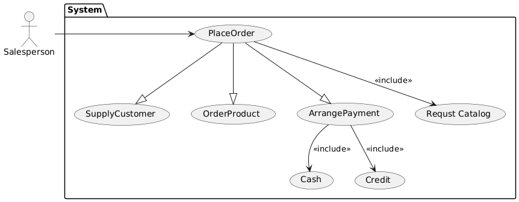

#### 一、简答题  5分 x 4

1. 软件架构的4+1视图
2. 用例驱动的设计是什么，有什么好处
3. 软件开发过程中的风险
4. 软件的分层架构是什么，举个典型例子

#### 二、改错题 20分

一个售货系统，用户是销售员sales person，销售员可以处理一个订单（？） place order，在 place order 时必须进行三个步骤：supply customer，order product，arrange payment ，其中 arrange payment 可以是 现金cash 也可以是 信用卡credit payment，在 place order 时，销售员可能may be 查询商品条目 request catalog，以下给出了一个用例图：（图凭回忆绘制 欢迎纠正）

1. 判断是否有错，错在哪里？
2. 画出修改后的用例图



```

```

#### 三、设计题 40分

一个租车公司开发一个系统 Calling Center，管理员可以在系统里注册（登记）汽车，包括车类型与其他信息，客户可以租借 rent，也可以归还 return，公司还希望记录下对应关系的条目，每个条目关联起用户和对应的车。

1. 用例图
2. 类图（叫什么bussiness model，无需属性和方法）
3. 写出边界类、控制类、实体类，以及对应简要描述
4. 租车到添加对应记录的顺序图

#### 四、分析题 20分

一个生产电子产品的公司，期望一个企业资源计划系统 Enterprise Resource Plan （ERP）

1. 描述组织架构 （Organization，不知道什么组织架构 人力？），给出用例图
2. 给出三个跨部门业务（Cross departmental business）的交互图（交互图）


