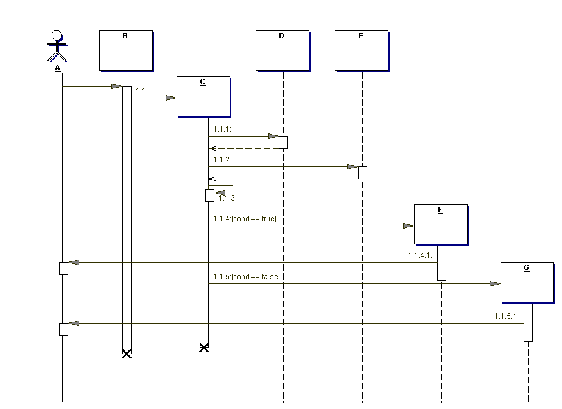

今年没考改错题，主要题型：简答题4道22分，填空题9道18分，设计题4道40分，分析题20分
**注意：左老师是英文出题

##### 一、简答题

1、What is Layered Architecture Model.give examples

2、What is Swimlane? Describe with example.

3、What is Bussiness use case model?

4、What is the difference between Analysis model and Design model?

##### 二、填空题

给了一张顺序图(时序图)，8问

1、A是什么？

2、B是什么对象？

3、C是什么对象？

4、D是什么对象？

5、虚线什么？

6、对象下的矩形是什么？

7、Why A is through D underlined?

8、Which of the following is an INVALID sequence of messages, according to the diagram?
A.	1, 1.1, 1.1.1, 1.1.2, 1.1.3, 1.1.4, 1.1.4.1
B.	1, 1.1, 1.1.1, 1.1.2, 1.1.3, 1.1.4, 1.1.4.1, 1.1.5, 1.1.5.1
C.	1, 1.1, 1.1.1, 1.1.2, 1.1.3, 1.1.5, 1.1.5.1

##### 三、设计题

消费卡业务系统，学生可以申请开卡，管理员在接到申请后创建卡，学生可以去超市使用卡买东西，收银员可以扣除(duduct)卡的金额，管理员可以把钱存入(deposit)卡中

1、绘制用例图

2、绘制整个系统的类图

3、绘制卡消费时的顺序图(时序图)

4、绘制消费卡类的状态图

##### 四、分析题

一个客户关系系统,介绍indicator of customer credit rating?
以两个indicators为例，绘制applied model并描述

